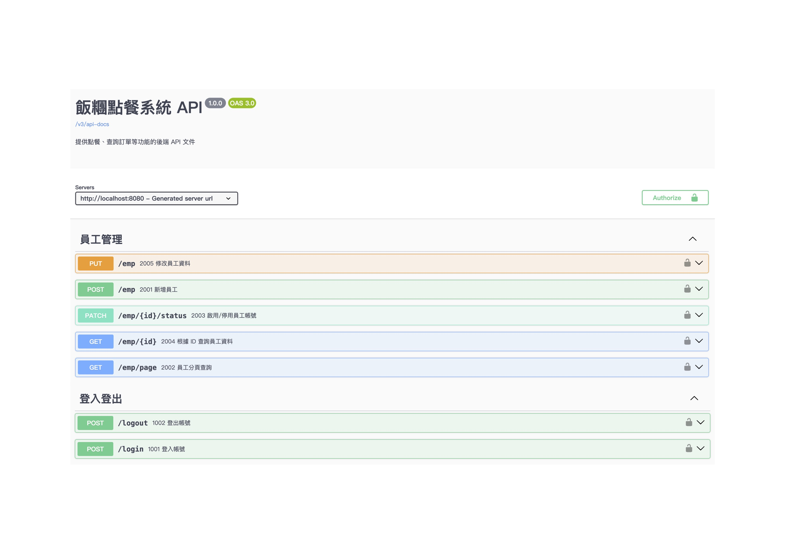

# QQ POS – 飯糰店家點餐 / 營收統計系統

> 一個為飯糰店家設計的簡易 POS 系統，協助店家在櫃檯快速點餐、管理菜單，並統計每日營收。

---

## 目錄

- [1. 專案簡介](#1-專案簡介)
- [2. 專案狀態與進度](#2-專案狀態與進度)
- [3. 架構概覽](#3-架構概覽)
- [4. 已完成功能](#4-已完成功能)
- [5. 測試策略](#5-測試策略)
- [6. 技術棧與環境](#6-技術棧與環境)
- [7. 如何快速開始](#7-如何快速開始)
- [8. 專案結構](#8-專案結構)
- [9. Roadmap](#9-roadmap)

## 1. 專案簡介

QQ-POS 是一個以「飯糰點餐流程」為題材的後端實作專案。

透過「訂單狀態流轉、權限區分與 API 驗證」等實務場景，
聚焦後端系統在實際開發中，經常因時程壓力或角色分工而被弱化的三個問題，
並透過自動化測試的角度，驗證這些設計是否能被穩定地落實於系統行為中：

- 系統狀態是否能被一致地限制與保護
- 錯誤情境是否具備清楚且可預期的回應行為
- 核心行為是否能被測試覆蓋，以降低後續修改造成的風險

這些問題在功能開發初期不一定顯眼，但隨著系統規模擴大，往往會成為後續維護與除錯成本的主要來源。
這不只是為了程式能正確運作，也希望在系統持續演進時，既有行為能被穩定地保護。

---
## 2. 專案狀態與進度

本專案以後端 API 為核心，未包含實際前端畫面。
所有功能皆透過 API 與測試驗證系統行為，作為設計與品質檢視的依據。

目前區分兩種使用角色：
- **manager**：可操作系統管理與維護相關功能（如員工管理、菜單管理），並可使用完整營運流程功能。
- **staff**：僅能使用與實際營運流程相關的功能（如登入與訂單操作），不具備任何系統設定或管理相關權限。

此權限區分用以驗證系統在不同角色下，是否能正確限制操作行為。

**目前進度：**
- 類型：Side Project
- 階段：開發中
- 已完成登入與員工管理等核心模組，並同步撰寫對應測試，作為後續功能擴充的基礎

---

## 3. 架構概覽

本專案以分層方式劃分系統責任，避免業務邏輯、資料存取與驗證規則混雜，讓核心行為能被獨立測試與驗證。

- **Controller**：負責接收請求與回傳 API 回應
- **Service**：集中處理業務邏輯、狀態判斷與權限規則
- **Mapper / Repository**：負責資料存取與持久化操作
- **Security / Filter**：處理身分驗證與存取控制
- **Exception Handler**：統一錯誤處理與回應格式
- **Test**：透過單元測試與整合測試驗證核心行為

核心流程以登入驗證與員工狀態變更為主要驗證場景。

---

## 4. 已完成功能

### 身分驗證（Login / Logout）
- 實作登入與登出流程
- 處理常見異常情境（資料缺失、帳號不存在、密碼錯誤）。
- 定義統一的錯誤回應格式，作為系統行為驗證與測試設計的基礎。

### 員工管理
- 實作查詢、新增、編輯、啟用 / 停用等功能。
- 於操作流程中加入權限檢查與資料驗證機制。
- 處理重複帳號與資料格式錯誤等例外情境。

### API 文件（Swagger UI）

以下為目前已完成模組的 API 文件畫面，  
用以展示系統模組劃分與權限保護狀態。



---

## 5. 測試策略

為確保核心功能在不同情境下皆能維持一致行為，
本專案針對關鍵流程撰寫單元測試與整合測試，
以驗證權限、狀態與錯誤回應是否符合預期。

測試內容包含：
- 未授權操作是否被正確阻擋，且不產生副作用
- 狀態變更後，其存取行為是否立即受到影響
- 例外情境是否能回傳一致且可預期的錯誤回應

### 代表測試案例

- **權限邊界：未授權操作不產生副作用**  
  staff 嘗試建立員工或變更狀態時，預期回傳 403，並於後續查詢中確認資料未被建立或狀態未被改動。

- **狀態流轉：停用後存取行為立即受限**  
  驗證帳號由 ACTIVE → INACTIVE → ACTIVE 的狀態切換，並確認帳號停用後，即使持有既有的 JWT Token，也會因帳號狀態檢查而被拒絕存取。

- **例外處理：錯誤回應一致且可預期**  
  模擬資料庫發生 DuplicateKeyException，由 Service 層處理並回傳對應的業務錯誤，確保 API 回傳一致且可預期的錯誤碼與訊息。

---

## 6. 技術棧與環境

- **語言 / 框架**：Java 17、Spring Boot 3.x
- **資料庫 / 持久層**：MySQL、MyBatis（PageHelper 分頁）
- **安全性**：Spring Security、JWT
- **測試**：JUnit 5、Mockito、Spring Security Test
- **文件 / 工具**：Gradle、SpringDoc（OpenAPI 3 / Swagger UI）

---

## 7. 如何快速開始

### 7.1 環境需求
- Java 17
- Spring Boot 3.x
- MySQL 8+

### 7.2 資料庫準備

本專案使用 MySQL 作為資料庫，請先建立資料庫並匯入資料表結構。

#### 7.2.1 建立資料庫（範例：`qq_pos_dev`）
```bash
mysql -u <user> -p -e "CREATE DATABASE IF NOT EXISTS qq_pos_dev DEFAULT CHARACTER SET utf8mb4;"
```
#### 7.2.2 匯入資料表結構
```bash
mysql -u <user> -p qq_pos_dev < ./db/qqPosDB.sql
```
#### 7.2.3 匯入初始資料
```bash
mysql -u <user> -p qq_pos_dev < ./db/seedUserTest.sql
```
匯入 `db/seedUserTest.sql` 後，系統會建立預設帳號/密碼供本機測試與開發驗證使用：
  - manager：`managerrole` / `(Qqpos1357`
- staff：`staffrole` / `(Qqpos1357`
> 此組帳密僅用於本機測試與示範；實際部署請自行更換。

#### 7.2.4 測試環境（範例：`qq_pos_test`）
```bash
mysql -u <user> -p -e "CREATE DATABASE IF NOT EXISTS qq_pos_test DEFAULT CHARACTER SET utf8mb4;"
mysql -u <user> -p qq_pos_test < ./db/qqPosDB.sql
mysql -u <user> -p qq_pos_test < ./db/seedUserTest.sql
```

#### 7.2.5 設定環境變數（.env）

```bash
cp .env.example .env
```
將 `.env.example` 複製為 `.env`，並依本機環境修改資料庫帳號密碼與 JWT key。

### 7.3 啟動專案

- 啟動方式：
```bash
./gradlew bootRun
```
- API 驗證：透過 API 呼叫進行功能驗證
- API 文件說明：啟動後請訪問 http://localhost:8080/swagger-ui/index.html
- 測試執行：
  ```bash
  ./gradlew test
  ```
---

## 8. 專案結構

### 主要程式（src/main/java）
```text
com.qqriceball
├── annotation      # 自訂註解，輔助共用行為
├── aspect          # AOP 切面邏輯
├── common          # 通用元件（例外、回應格式、工具類）
│   ├── exception
│   ├── properties
│   ├── result
│   └── utils
├── config          # 系統設定（Security、JWT、Swagger 等）
├── controller      # API 控制層，負責請求與回應
├── enumeration     # 系統常數與狀態列舉
├── handler         # 全域例外處理
├── mapper          # MyBatis Mapper（SQL 定義於 resources）
├── model           # 資料模型
│   ├── dto         # 請求資料
│   ├── entity      # 資料庫實體
│   └── vo          # 回應資料
└── service         # 業務邏輯層
```

### 測試（src/test/java）
```text
com.qqriceball
├── unit            # 單元測試，驗證單一類別的業務邏輯與錯誤處理
│   ├── controller  # Controller 層的請求與回應行為
│   └── service     # Service 層的業務規則與例外處理
└── integration     # 整合測試，驗證完整流程與權限行為
    └── testData    # 共用測試用資料
```

---
## 9. Roadmap

以下列出目前已完成與預計實作的功能項目。

- [x] 專案基礎建置（Spring Boot + MyBatis）
- [x] 基本身分驗證流程（登入 / 登出）
- [x] JWT 驗證與角色權限區分（manager / staff）
- [x] 員工管理功能
  - [x] 新增、查詢、編輯員工
  - [x] 啟用 / 停用員工帳號

- [ ] 菜單管理
  - [ ] 菜單分類與品項維護
  - [ ] 上下架狀態控制
- [ ] 訂單管理
  - [ ] 建立訂單
  - [ ] 訂單狀態變更與查詢
- [ ] 營收相關功能
  - [ ] 每日營收統計
  - [ ] 依日期區間查詢營收結果