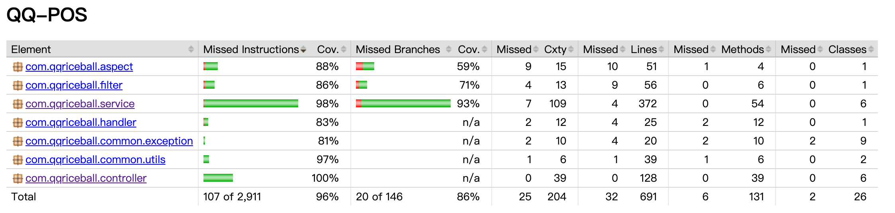

# QQ POS – 飯糰店家點餐管理系統

> 以飯糰店營運情境為題的後端 POS 系統，實作登入驗證、員工權限、產品管理與訂單流程，並透過單元測試與整合測試驗證核心行為。

[](https://github.com/shortlegK/QQ-POS/actions/workflows/ci.yml)


## 線上 Demo
- **前端介面**：[qq-pos.vercel.app](https://qq-pos.vercel.app/)
- **API 文件（Swagger UI）**：[開啟 Swagger](https://qq-pos-production.up.railway.app/swagger-ui/index.html#/)
前端介面主要用於展示實際操作流程，後端則聚焦於 API、權限控管、測試與部署實作。

> **測試帳號**

 | 角色 | 帳號 | 密碼 |
 |------|------|------|
 | manager | `demomanager` | `Qq!pos3426` |
 | staff | `demostaff` | `Qq!pos3426` |

---

## 目錄

- [1. 專案簡介](#1-專案簡介)
- [2. 系統角色與權限設計](#2-系統角色與權限設計)
- [3. 架構概覽](#3-架構概覽)
- [4. 已實作功能](#4-已實作功能)
- [5. 測試概況與策略](#5-測試概況與策略)
- [6. CI/CD](#6-cicd)
- [7. 如何快速開始](#7-如何快速開始)
- [8. 技術棧與環境](#8-技術棧與環境)
- [9. 專案結構](#9-專案結構)
- [10. Roadmap](#10-roadmap)

## 1. 專案簡介

QQ-POS 是一個以飯糰店日常營運流程為情境的後端 POS 系統，透過 API 方式支援櫃檯點餐與後台管理操作。

專案核心聚焦於以下幾個面向：

- 以角色權限區分 manager / staff 的操作範圍
- 以產品、選項與訂單流程模擬實際點餐場景
- 透過分層設計與測試驗證，提升功能維護性與穩定性

## 2. 系統角色與權限設計

本系統區分為兩種角色，用以模擬店家實際營運中的權限差異：

- **manager**：可操作員工管理、產品管理與完整營運功能
- **staff**：僅能使用與日常點餐流程相關的功能，不具備系統管理權限

此角色區分也是本專案測試設計的重要依據，用來驗證不同角色在相同 API 下的存取限制是否正確。

---

## 3. 架構概覽

本專案採分層設計，將請求處理、業務邏輯、資料存取與錯誤處理分開，方便維護與測試。

- **Controller**：接收請求並回傳 API 回應
- **Service**：處理業務邏輯、權限判斷與狀態規則
- **Mapper**：負責資料存取
- **Security / Filter**：處理登入驗證與存取控制
- **Exception Handler**：統一錯誤回應格式

---

## 4. 已實作功能

### 身分驗證（Login / Logout）
- 實作登入、登出與 JWT 驗證流程
- 處理帳號不存在、密碼錯誤、帳號已停用等常見異常情境

### 員工管理
- 提供員工查詢、新增、編輯與啟用/停用功能
- 依角色限制操作權限，並處理帳號重複與資料格式錯誤等情境

### 產品管理
- 提供產品新增、查詢、編輯與上/下架狀態調整
- 可依名稱、類型與上架狀態進行分頁查詢

### 選項管理
- 提供選項新增、查詢、編輯與上/下架狀態調整
- 依選項類型進行資料驗證，並處理名稱重複等異常情境

### 訂單管理
- 提供訂單建立、查詢、修改與狀態更新流程
- 建立訂單時會驗證商品上架狀態、選項有效性與必填設定
- 提供 catalog API，整合可訂購品項與對應細節選項資訊

### 帳號管理
- 提供登入帳號的密碼變更功能
- 變更前需驗證舊密碼，並處理錯誤密碼與資料格式不符等情境

### API 文件（Swagger UI）

以下為目前已完成模組的 API 文件畫面：


---

## 5. 測試概況與策略

目前專案測試覆蓋率為 **96%**，並於 CI 中設定最低門檻 **85%**，作為後續功能調整時的基本品質檢查。
<details>
<summary>查看 JaCoCo 覆蓋率報告</summary>



</details>

覆蓋率僅作為基本品質門檻，並不直接代表測試品質。本專案的測試重點放在：

- 核心業務邏輯是否正確
- 權限控制是否符合角色限制
- 狀態變更後的系統行為是否正確
- 例外情境是否回傳一致且可預期的錯誤結果

### 測試分層

本專案的測試主要分為單元測試與整合測試兩個層級：

- **單元測試（Unit Test）**
  - **Service 測試**：使用 Mock 資料驗證業務邏輯判斷、例外處理與資料更新行為是否符合預期，不直接操作資料庫
  - **Controller 測試**：驗證 API 在接收 Service 回傳結果或例外時，是否正確回傳對應的 HTTP status、錯誤碼、訊息與必要的回應資料

- **整合測試（Integration Test）**
  - 使用 MockMvc 模擬實際請求流程，驗證 Controller、Service 與資料庫之間的整體行為是否正確，包含權限控制、資料異動與錯誤回應

### 代表測試案例

- **權限邊界**：驗證 staff 嘗試建立員工或變更帳號狀態時，API 應回傳 403，且資料不得被建立或修改
- **狀態限制**：驗證帳號停用後，即使仍持有既有 JWT Token，也會因帳號狀態檢查而被拒絕存取
- **帳號安全**：驗證使用者成功修改密碼後，可使用新密碼重新登入；若舊密碼錯誤，則應回傳固定錯誤碼與訊息
- **例外處理**：模擬資料庫發生 DuplicateKeyException 等異常情境，確認 API 回傳格式一致，便於前端處理

---

## 6. CI/CD

本專案透過 GitHub Actions 實作自動化測試與部署流程。
每次 push 或 PR 到 `master` / `develop` 分支時會自動觸發。

**Pipeline 流程**

```
push / PR → [test] → [coverage] → [deploy]（僅 master）
```

| Stage | 說明 |
|-------|------|
| **test** | 啟動 MySQL container，執行全部單元與整合測試 |
| **coverage** | 驗證 JaCoCo 測試覆蓋率門檻 ≥ 85% |
| **deploy** | 通過前兩關後，自動部署到 Railway（僅限 master 分支） |

---

## 7. 如何快速開始

### 7.1 環境需求
- Java 17
- Spring Boot 3.x
- MySQL 8+

### 7.2 資料庫準備

本專案使用 MySQL 作為資料庫，請先建立資料庫並匯入資料表結構。

#### 7.2.1 建立資料庫（範例：`qq_pos_dev`）
```bash
mysql -u <user> -p -e "CREATE DATABASE IF NOT EXISTS qq_pos_dev DEFAULT CHARACTER SET utf8mb4;"
```
#### 7.2.2 匯入資料表結構
```bash
mysql -u <user> -p qq_pos_dev < ./db/qqPosDB.sql
```

#### 7.2.3 測試環境（範例：`qq_pos_test`）
```bash
mysql -u <user> -p -e "CREATE DATABASE IF NOT EXISTS qq_pos_test DEFAULT CHARACTER SET utf8mb4;"
mysql -u <user> -p qq_pos_test < ./db/qqPosDB.sql
```

#### 7.2.4 設定環境變數（.env）

```bash
cp .env.example .env
```
將 `.env.example` 複製為 `.env`，並依本機環境修改資料庫帳號密碼與 JWT key。

### 7.3 啟動專案

**開發環境啟動（dev）**
```bash
./gradlew bootRun --args='--spring.profiles.active=dev'
```

**啟動並建立開發用 demo 帳號（可選）**
```bash
./gradlew bootRun --args='--spring.profiles.active=dev --app.seed-demo=true'
```
demo 帳號：  
manager：`demomanager` / `Qq!pos3426`  
staff：`demostaff` / `Qq!pos3426`

**測試執行**
  ```bash
  ./gradlew test
  ```
測試環境會自動建立測試所需資料，且不影響開發或正式環境。

---

## 8. 技術棧與環境

- **語言/框架**：Java 17、Spring Boot 3.x
- **資料庫/持久層**：MySQL、MyBatis、PageHelper
- **安全性**：Spring Security、JWT
- **測試**：JUnit 5、Mockito、MockMvc、Spring Security Test
- **文件/工具**：Gradle、SpringDoc（OpenAPI 3 / Swagger UI）
- **CI/CD**：GitHub Actions、Railway（部署平台）

---

## 9. 專案結構

### 9.1 主要程式（src/main/java）
```text
com.qqriceball
├── annotation      # 自訂註解
├── aspect          # AOP 邏輯
├── common          # 通用元件（例外、回應格式、工具類）
│   ├── exception
│   ├── properties
│   ├── result
│   └── utils
├── config          # 系統設定（Security、JWT、Swagger 等）
├── controller      # API 控制層，負責請求與回應
├── enumeration     # 系統常數與狀態列舉
├── handler         # 全域例外處理
├── mapper          # MyBatis Mapper
├── model           # 資料模型
│   ├── dto         # 請求資料
│   ├── entity      # 資料庫實體
│   └── vo          # 回應資料
└── service         # 業務邏輯層
```

### 9.2 測試（src/test/java）
```text
com.qqriceball
├── unit
│   ├── controller  # Controller 單元測試
│   └── service     # Service 單元測試
├── integration     # 整合測試
├── testData        # 共用測試資料
└── utils           # 測試工具類
```

---
## 10. Roadmap

以下列出目前已完成與預計實作的功能項目。

- [x] 專案基礎建置（Spring Boot + MyBatis）
- [x] 基本身分驗證流程（登入/登出）
- [x] JWT 驗證與角色權限區分（manager/staff）
- [x] 員工管理功能
  - [x] 新增、查詢、編輯員工
  - [x] 啟用/停用員工帳號
- [x] 產品管理
  - [x] 新增、編輯產品
  - [x] 查詢產品
  - [x] 調整上架/下架狀態
- [x] 選項管理
  - [x] 新增、編輯選項
  - [x] 查詢選項
  - [x] 調整上架/下架狀態
- [x] 訂單管理
  - [x] 建立訂單
  - [x] 修改訂單
  - [x] 訂單狀態變更
  - [x] 查詢訂單(依訂單編號、狀態、日期等條件)
- [x] 帳號管理
  - [x] 變更密碼
- [ ] 營收統計
  - [ ] 每日營收統計
  - [ ] 依日期區間查詢營收
  - [ ] 營收明細查詢